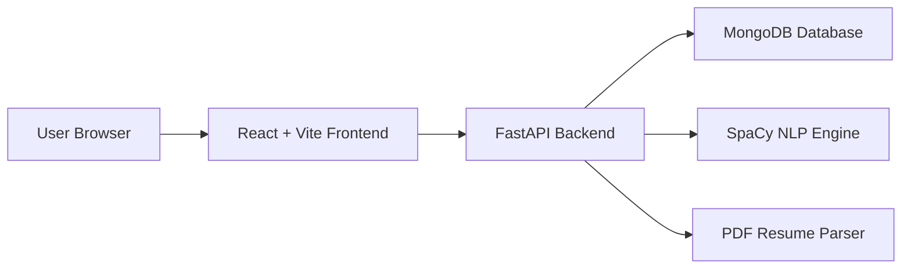
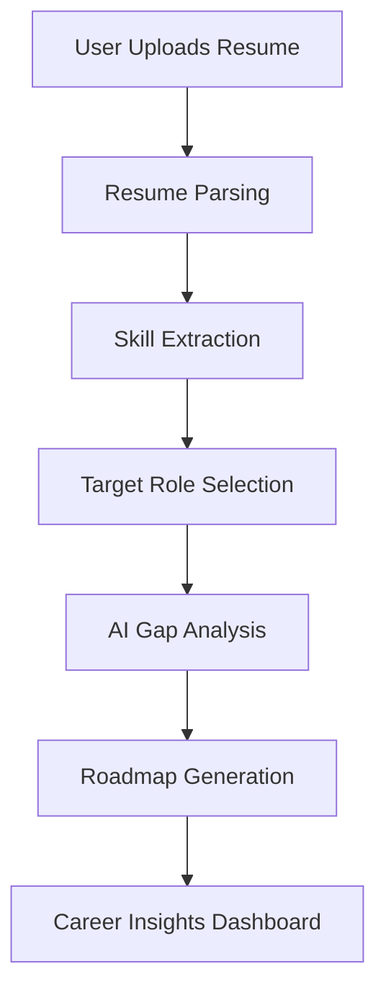
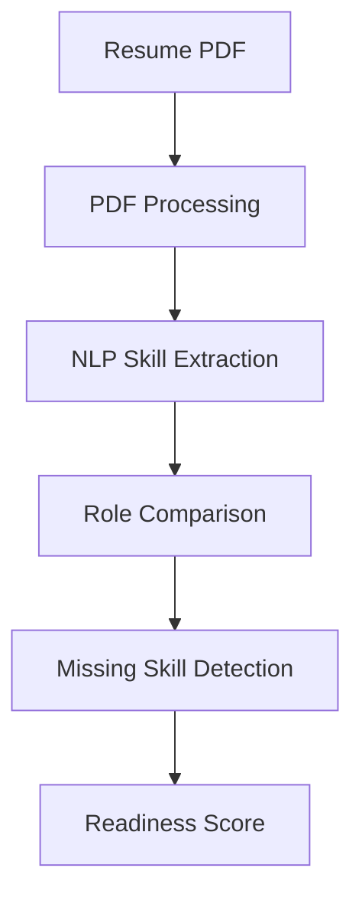

<div align="center">


<br/>


<h1>🚀 SkillGap AI</h1>

<p><strong>"Google Maps for Career Development"</strong></p>

<p>
  <a href="https://react.dev/">
    
  </a>

  <a href="https://vitejs.dev/">
    
  </a>

  <a href="https://fastapi.tiangolo.com/">
    
  </a>

  <a href="https://www.mongodb.com/">
    
  </a>

  <a href="https://spacy.io/">
    
  </a>

  <a href="https://vercel.com/">
    
  </a>
</p>

<br/>

### 🌐 Live Demo  
https://ai-skills-gap-analyzer-ten.vercel.app

### 💻 GitHub Repository  
https://github.com/Iqra-Fatima-07/SkillGapAI

> **Analyze your skills, discover missing technologies, and generate an AI-powered roadmap toward your dream career.**

</div>

---

# 📚 Table of Contents

1. Project Overview  
2. Core Features  
3. AI-Powered Career Intelligence  
4. System Architecture  
5. User Workflow  
6. Technical Stack  
7. Project Structure  
8. Security & Authentication  
9. Installation & Local Setup  
10. Environment Variables  
11. API Endpoints  
12. Deployment  
13. Future Enhancements  
14. Contribution Guide  
15. Author & License  

---

# 1. 🚀 Project Overview

AI Skill Gap Analyzer is a full-stack AI-powered career intelligence platform designed to help students, developers, and professionals evaluate their technical skills against real-world job requirements.

The platform intelligently:

- Parses resumes
- Extracts technical skills using NLP
- Compares user profiles with target job roles
- Detects missing skills
- Generates personalized learning recommendations
- Calculates a Job Readiness Score

The goal is to transform random learning into a structured career roadmap powered by AI and data-driven analysis.

---

# 2. 🌟 Core Features

## 2.1 Resume Skill Extraction

- Upload PDF resumes
- AI-powered skill detection
- NLP-based keyword extraction
- Experience & technology identification
- Automatic resume parsing

---

## 2.2 Skill Gap Analysis

- Compare current skills with target roles
- Detect missing technologies
- Analyze readiness for industry roles
- Personalized improvement recommendations
- Real-time gap insights

---

## 2.3 AI Career Roadmap Generation

- Step-by-step learning roadmap
- Structured technology progression
- Recommended learning order
- Suggested project-building path
- Career-focused upskilling strategy

---

## 2.4 Job Readiness Score

- AI-generated readiness percentage
- Strength & weakness analysis
- Domain-specific evaluation
- Technical competency insights
- Career preparedness tracking

---

## 2.5 Authentication & Security

- Secure JWT Authentication
- Login & Registration APIs
- Token-based session handling
- Protected backend routes
- Environment-based secret management

---

# 3. 🧠 AI-Powered Career Intelligence

## 3.1 NLP-Based Resume Understanding

The platform uses Natural Language Processing (NLP) to analyze resumes and identify:

- Programming languages
- Frameworks & libraries
- Databases
- Cloud technologies
- AI/ML skills
- Development tools

---

## 3.2 Intelligent Role Matching

The AI engine compares extracted skills against:

- Industry job requirements
- Domain-specific skill maps
- Career pathways
- Real-world technology stacks

and generates highly personalized recommendations.

---

## 3.3 Personalized Learning Recommendations

Based on missing skills, the platform suggests:

1. Technologies to learn
2. Priority learning sequence
3. Career roadmap structure
4. Suggested projects
5. Skill improvement direction

---

# 4. 🏗️ System Architecture



---

# 5. 🔄 User Workflow

## 5.1 High-Level User Flow



---

## 5.2 Skill Analysis Pipeline



---

# 6. ⚙️ Technical Stack

## Frontend

- React.js
- Vite
- Tailwind CSS
- Recharts

---

## Backend

- FastAPI
- Python
- REST API Architecture
- JWT Authentication

---

## AI / NLP Engine

- SpaCy NLP
- PDFPlumber
- OCR Processing
- Resume Parsing Engine

---

## Database

- MongoDB
- Motor Async Driver

---

## Deployment

- Vercel (Frontend)
- Render / AWS (Backend)

---

# 7. 📁 Project Structure

```bash
SkillGapAI/
│
├── frontend/                     # React + Vite frontend
│   ├── src/
│   │   ├── components/           # Reusable UI components
│   │   ├── pages/                # Application pages
│   │   ├── services/             # API integrations
│   │   ├── hooks/                # Custom React hooks
│   │   ├── context/              # Context providers
│   │   └── assets/               # Static assets
│   │
│   ├── public/
│   ├── package.json
│   └── vite.config.js
│
├── backend/                      # FastAPI backend
│   ├── routes/                   # API routes
│   ├── models/                   # Database models
│   ├── services/                 # Business logic
│   ├── utils/                    # Helper utilities
│   ├── middleware/               # Auth middlewares
│   ├── requirements.txt
│   └── main.py
│
├── wiki/                         # Documentation
├── README.md
└── .gitignore
```

---

# 8. 🔒 Security & Authentication

- 🔐 JWT Authentication
- 🛡️ Protected API routes
- 🔒 Secure environment variables
- ☁️ MongoDB Atlas integration
- 🚫 No hardcoded credentials
- ✅ CORS security configuration

---

# 9. ⚡ Installation & Local Setup

## Prerequisites

| Requirement | Version |
|---|---|
| Node.js | v18+ |
| Python | v3.10+ |
| MongoDB | Local or Atlas |
| npm | Latest |

---

## Clone Repository

```bash
git clone https://github.com/Iqra-Fatima-07/SkillGapAI.git

cd SkillGapAI
```

---

## Backend Setup (FastAPI)

```bash
cd backend

python -m venv venv

# Windows
venv\Scripts\activate

# Linux / Mac
source venv/bin/activate

pip install -r requirements.txt

uvicorn main:app --reload
```

Backend runs at:

```bash
http://127.0.0.1:8000
```

Swagger Docs:

```bash
http://127.0.0.1:8000/docs
```

---

## Frontend Setup (React + Vite)

Open a new terminal:

```bash
cd frontend

npm install

npm run dev
```

Frontend runs at:

```bash
http://localhost:5173
```

---

# 10. 🔑 Environment Variables

## Backend `.env`

```env
MONGO_URL=your_mongodb_connection_string

SECRET_KEY=your_secret_key

GEMINI_API_KEY=your_api_key

FRONTEND_URL=http://localhost:5173

ENVIRONMENT=development
```

---

## Frontend `.env`

```env
VITE_API_URL=http://localhost:8000
```

---

# 11. 🔌 API Endpoints

| Method | Endpoint | Description |
|---|---|---|
| POST | /register | Register new user |
| POST | /login | User authentication |
| POST | /analyze | Resume skill analysis |
| GET | /jobs | Available job roles |
| GET | /dashboard | Career insights |

---

# 12. 🚀 Deployment

## Frontend Deployment

- Vercel

---

## Backend Deployment

- Render
- AWS App Runner
- AWS EC2

---

## Database Hosting

- MongoDB Atlas

---

# 13. 🔮 Future Enhancements

- AI Interview Preparation
- GitHub Profile Analysis
- LinkedIn Skill Matching
- Live Industry Trend Analysis
- AI Mock Interviews
- Skill Progress Tracking
- Company-Specific Role Analysis
- Personalized DSA Roadmaps

---

# 14. 🤝 Contribution Guide

## Commit Convention

```bash
type(scope): message
```

Examples:

```bash
feat(ai): improve roadmap generation
fix(auth): resolve JWT token issue
docs(readme): update setup guide
```

---

## Branch Naming

```bash
feature/resume-analyzer
feature/dashboard-ui
fix/backend-auth
refactor/api-cleanup
```

---

## Pull Request Guidelines

- Add clear description
- Include screenshots if UI changes
- Mention testing steps
- Reference related issues

---

# 15. 👨‍💻 Author & License

## Author

Iqra Fatima  
AI Engineer | Full-Stack Developer | AI Systems Builder

GitHub:  
https://github.com/Iqra-Fatima-07

Repository:  
https://github.com/Iqra-Fatima-07/SkillGapAI

---

## License

This project is licensed under the MIT License.

Copyright (c) 2026 Iqra Fatima

Permission is hereby granted, free of charge, to any person obtaining a copy  
of this software and associated documentation files (the "Software"), to deal  
in the Software without restriction.

The Software is provided "AS IS", without warranty of any kind.

---

<div align="center">

### ⭐ If you found this project useful, consider starring the repository!
<p align="center">
  Made with ❤️ by <strong>Iqra Fatima</strong>
</p>


</div>
