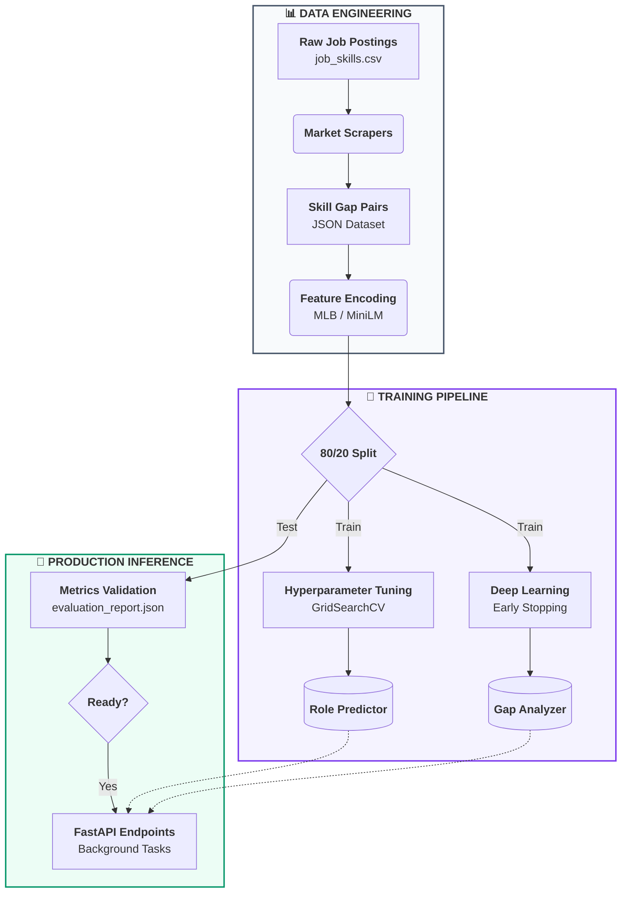
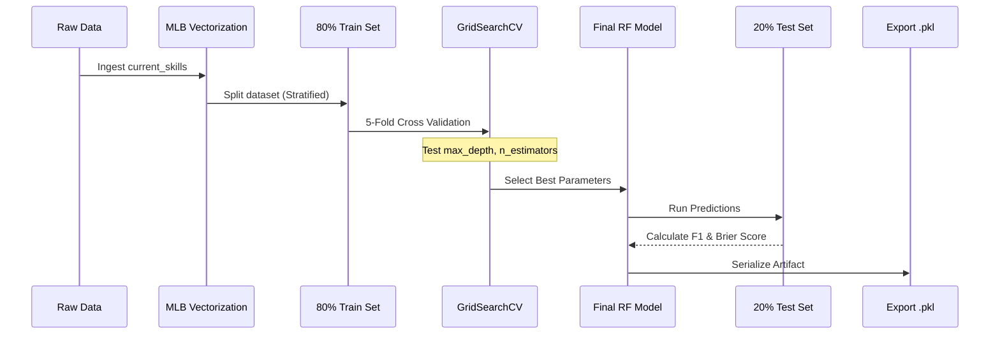
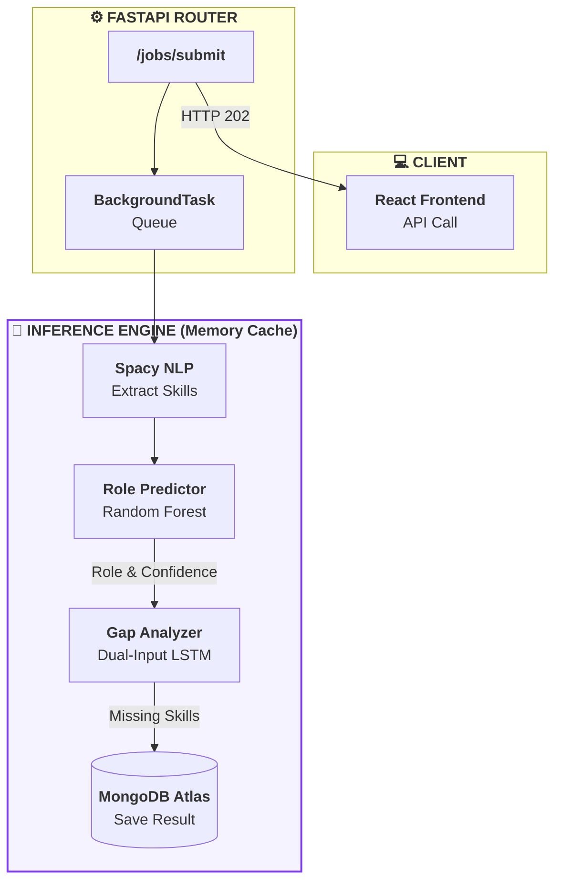
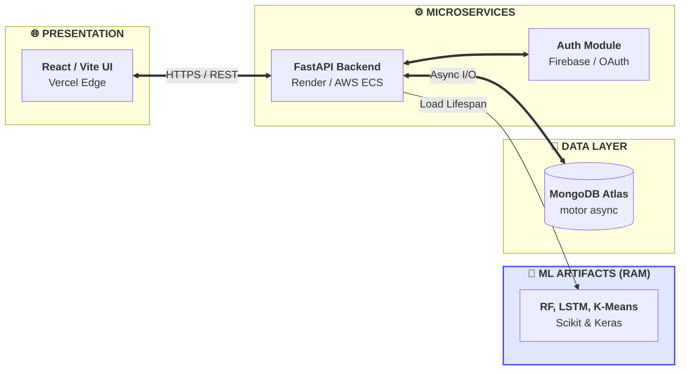

# Machine Learning Engineering & Model Architecture (v1.0)

This document provides a comprehensive technical deep-dive into the Machine Learning models that power the **AI Skill Gap Analyzer**. It covers the architecture, mathematical foundations, training workflows, and evaluation metrics for each component.

---

## 🚀 Model Performance Summary (v1.0)

The system currently operates on **v1.0** artifacts, trained on a corpus of **5,656** total samples across all models.

| Model | Primary Metric | Score | Status |
| :--- | :--- | :--- | :--- |
| **Role Predictor** | Weighted F1-Score | **0.9851** | ✅ Optimal |
| **Missing Skills LSTM** | Recall@10 | **0.9280** | ✅ Optimal |
| **Skill Clusterer** | Silhouette Score | **0.0219** | ⚠️ Warn (High-Dim) |

---

## 📊 Training Dataset Architecture

The models were trained using a high-quality synthesized dataset derived from a **100,000-row** job skills database.

### 1. Skill-Gap Pairs (`skill_gap_pairs.json`)
*   **Total Pairs:** 2,246
*   **Roles Covered:** 63 unique job profiles.
*   **Avg. Gap Ratio:** 0.723 (Average percentage of missing skills per profile).
*   **Data Generation Strategies:**
    *   **Simulated Coverage (33%)**: Generating "typical" skill sets for each role.
    *   **Row Snapshot (55%)**: Sampling real-world employee profiles from the dataset.
    *   **Core Only (12%)**: High-seniority profiles containing only "Expert" skills.

### 2. Feature Schema
```json
{
  "target_role": "Backend Developer",
  "seniority": "Mid-level",
  "current_skills": ["Python", "FastAPI", "PostgreSQL"],
  "missing_skills": ["Redis", "Docker", "Kubernetes", "CI/CD"],
  "gap_ratio": 0.57
}
```

---

## 🛠️ Model-Specific Deep Dive

### 1. Role Predictor (Random Forest)
The Role Predictor is responsible for mapping a list of extracted skills to one of the 63 supported job roles.

*   **Hyperparameter Tuning (Grid Search)**: 
    *   **Grid Size**: 72 combinations (3 `n_estimators` × 4 `max_depth` × 3 `min_samples_split` × 2 `max_features`).
    *   **Optimal Config**: `n_estimators=300`, `max_depth=None`, `min_samples_split=2`.
*   **Per-Role Success Highlights**:
    *   **1.0 F1 (Perfect)**: AI Engineer, Blockchain, Cyber Security, Android Developer.
    *   **0.92 F1 (High)**: Backend Developer, DevOps, Linux Engineer.
    *   **0.85 F1 (Target for next version)**: Data Analyst.

### 2. Missing Skills Predictor (LSTM)
A dual-input Recurrent Neural Network (RNN) that understands the *relationship* between current skills and the target role.

*   **Logic**: Uses **Masking** to handle varying resume lengths (up to 20 skills) and **Concatenation** to inject "Context" (Target Role + Seniority).
*   **Efficiency**: Latency is optimized at **2.23ms** per request, allowing for real-time roadmap generation.
*   **Top 50 Vocab**: The model focuses on the 50 most in-demand "gap" skills globally to ensure high-priority recommendations.

### 3. Skill Clusterer (K-Means)
Groups skills semantically to provide "Domain-Based" analysis (e.g., grouping React/Vue under 'Frontend').

*   **Optimal K-Selection**: Found using the **Elbow Method** (Sum of Squared Errors).
*   **Cluster Quality**: 
    *   **Cluster 3**: Advanced AI (Transformers, LLMs).
    *   **Cluster 8**: Enterprise Java (Spring, Design Patterns).
    *   **Cluster 11**: DevOps/VCS (Git, GitHub, CI/CD).

---

## 📈 Evaluation Metrics & Formulas

| Metric | Formula | Purpose |
| :--- | :--- | :--- |
| **Weighted F1** | $\frac{\sum w_i F1_i}{\sum w_i}$ | Handles class imbalance in job role distribution. |
| **Recall@10** | $\frac{TP \in \text{Top 10}}{TP}$ | Measures if the most important skills are in the user's view. |
| **AUC-ROC** | $\text{Area under Curve}$ | Measures the model's ability to distinguish between roles. |
| **Brier Score** | $\frac{1}{N} \sum (p - y)^2$ | Lower is better. Validates "Confidence %" accuracy. |

---

## 🔄 Lifecycle: Training to Production
1.  **Weekly APScheduler**: Runs `find_optimal_k.py` to detect "Skill Drift."
2.  **GridSearch**: Triggered if new roles are added to the taxonomy.
3.  **Versioning**: Every model run generates an `evaluation_report.json` and versioned artifacts in `ml_models/vX.Y/`.

---
---

# Part II: Comprehensive ML Technical Thesis & Implementation Report

## 1. ML Model Overview

The AI Skill Gap Analyzer leverages a suite of machine learning algorithms to bridge the gap between a candidate's current technical skill set and the dynamic demands of the job market. Based on the actual implementation found in the `backend/models` directory, the system utilizes three primary machine learning models, each tailored to solve a distinct problem:

1.  **Role Predictor**: A supervised classification model (Random Forest) that predicts the most suitable job role for a candidate based on their existing skills.
2.  **Missing Skills Predictor**: A deep learning model (Dual-Input LSTM) designed as a recommendation system to identify the top technical skills a candidate lacks to achieve their target role.
3.  **Skill Clusterer**: An unsupervised learning model (K-Means) that semantically groups skills into broad technological domains (e.g., Frontend, AI/ML, DevOps).

### Problem Statement and Prediction Objective
In the rapidly evolving tech industry, professionals often struggle to identify exact skill gaps preventing them from transitioning into new or advanced roles. The objective of this ML system is to accurately map a user's extracted resume skills to a specific job role, and then recommend a highly personalized, ranked list of missing skills that form the basis of a career roadmap.

### User Interaction Flow
1.  **Input**: The user uploads a resume (PDF/DOCX) or manually enters a GitHub username.
2.  **Extraction**: The system extracts raw text and uses NLP techniques to identify technical skills.
3.  **Role Prediction**: The extracted skills are passed to the Role Predictor. If the model's confidence exceeds 60% ($>0.60$), it auto-assigns a target role.
4.  **Gap Analysis**: The user's current skills and the target role are passed to the Missing Skills Predictor, which outputs a ranked list of skills to learn.
5.  **Output**: The frontend displays an interactive dashboard featuring the predicted role, readiness score, and a generative AI roadmap based on the ML-predicted skill gaps.

---

## 2. Model Folder Analysis

The `backend/models` directory is the core intelligence hub of the platform. Below is a detailed structural breakdown and analysis of its contents.

### Directory Structure

```text
backend/models/
├── data/
│   ├── industry_demand.json        # Categorical skill demand weights
│   ├── skill_categories.json       # Taxonomy of skills mapped to domains
│   └── skill_gap_pairs.json        # Core 13MB training dataset (2,246 records)
├── ml_models/
│   └── v1.0/
│       ├── config.json             # Feature names and class labels mapping
│       ├── evaluation_report.json  # Comprehensive per-role and global metrics
│       ├── metadata.json           # Versioning and training context
│       ├── missing_skills_lstm.h5  # Legacy Keras format model
│       ├── missing_skills_lstm.keras # Modern Keras format LSTM model
│       ├── missing_skills_mlb.pkl  # MultiLabelBinarizer for Top 50 missing skills
│       ├── role_encoder.pkl        # LabelEncoder for the 63 job roles
│       ├── role_predictor.pkl      # Trained Random Forest classifier
│       ├── scaler.pkl              # StandardScaler for numeric features
│       ├── seniority_encoder.pkl   # OneHotEncoder for seniority levels
│       └── skill_clusterer.pkl     # Trained K-Means model for semantic grouping
├── ml_training/
│   ├── outputs/
│   │   ├── elbow_curve.png         # Plot of K-Means inertias
│   │   ├── elbow_result.json       # Optimal K value output
│   │   ├── rf_cv_results.json      # GridSearch hyperparameter results
│   │   └── rf_cv_scores.png        # Heatmap of Random Forest F1 scores
│   ├── evaluate_models.py          # Script to generate evaluation_report.json
│   ├── find_optimal_k.py           # Runs Elbow method to find optimal clusters
│   ├── generate_skill_embeddings.py# Uses MiniLM to vectorize taxonomy
│   ├── process_industry_demand.py  # Utility to parse raw market data
│   ├── train_missing_skills_lstm.py# LSTM model training script
│   ├── train_role_predictor.py     # Random Forest training script
│   ├── train_skill_clusterer.py    # K-Means training script
│   ├── verify_issue23.py           # Utility for testing/debugging
│   └── versioning.py               # Helper script to standardize model exports
├── test_missing_skills_lstm.py     # Unit/Integration tests for LSTM inference
├── test_role_predictor.py          # Unit/Integration tests for RF inference
```

### Detailed File Explanations

#### Training Scripts (`ml_training/`)
*   **`train_role_predictor.py`**: The primary script for training the supervised classification model. It loads `skill_gap_pairs.json`, uses a `MultiLabelBinarizer` to encode input skills, performs an 80/20 train-test split, and executes a 72-combination `GridSearchCV` on a `RandomForestClassifier`. It exports `role_predictor.pkl` and `config.json`.
*   **`train_missing_skills_lstm.py`**: Trains the recommendation engine. It handles sequential data by utilizing a `SentenceTransformer` to create 384-dimensional embeddings of skills. It builds a dual-input Keras Functional API model (LSTM for sequence, Dense for categorical metadata) and trains it using `EarlyStopping`. It exports the model in `.keras` format.
*   **`train_skill_clusterer.py`**: Reads optimal K values from `elbow_result.json` to train a K-Means model on skill embeddings, grouping skills into semantic clusters.
*   **`versioning.py`**: A crucial helper script that ensures every training run saves artifacts into a versioned folder (e.g., `v1.0`) with a standardized `metadata.json` to maintain strict ML provenance.

#### Artifacts (`ml_models/v1.0/`)
*   **`evaluation_report.json`**: Acts as the ultimate truth for model performance. It stores metrics like AUC-ROC, Precision/Recall per role, Silhouette scores, and MRR. The backend reads this file to assess whether a model version is healthy enough for inference.
*   **Pickle Files (`.pkl`)**: These store the exact state of the scikit-learn models and preprocessors. `missing_skills_mlb.pkl` is specifically used to decode the LSTM's 50-dimensional binary output back into human-readable skill names.

---

## 3. End-to-End ML Workflow

The machine learning workflow is designed as a fully automated pipeline, from raw data ingestion to real-time API inference.

### Workflow Diagram



### Step-by-Step Flow

1.  **Data Collection & Loading**: Market data is scraped and stored as `skill_gap_pairs.json`. The training scripts load this JSON using Python's native `json` library, parsing lists of `current_skills` and `target_role`.
2.  **Preprocessing & Feature Extraction**:
    *   For the **Role Predictor**: The variable-length lists of strings (`current_skills`) are transformed into fixed-length binary vectors using `MultiLabelBinarizer`. Target roles are integer-encoded using `LabelEncoder`.
    *   For the **LSTM**: Raw skill strings are passed through a pre-trained `all-MiniLM-L6-v2` transformer to extract 384-dimensional dense vectors representing semantic meaning. Seniority and Role are One-Hot Encoded.
3.  **Train-Test Split**: Data is rigorously split 80/20 using `train_test_split(stratify=y)` to ensure rare job roles are proportionally represented in both sets.
4.  **Hyperparameter Tuning**: `GridSearchCV` explores the parameter space. For instance, testing `n_estimators` across [100, 200, 300] and `max_depth` across [10, 15, 20, None].
5.  **Model Training**: Models are fit to the `X_train` and `y_train` data. The LSTM uses the Adam optimizer with `binary_crossentropy` loss.
6.  **Validation & Evaluation**: The models infer on the 20% holdout test set. Scripts calculate Precision, Recall, F1, MRR, and Brier Scores.
7.  **Model Saving**: The `versioning.py` script packages the model weights, encoders, and evaluation results into `ml_models/vX.Y/`.
8.  **Real-Time Inference**: The FastAPI application loads these artifacts into memory during application startup (`lifespan` event) and exposes them via `/api/v1/predict-role` and background worker tasks.

---

## 4. Detailed ML Concepts Used

### Supervised Learning (Classification)
*   **Concept**: Learning a function that maps an input to an output based on example input-output pairs.
*   **Implementation**: The **Role Predictor** uses Random Forest to map an array of input skills ($X$) to a discrete job role ($y$).
*   **Why**: Classification is necessary because the target variable (Job Role) is categorical and finite (63 distinct classes).

### Deep Learning (Recurrent Neural Networks / LSTM)
*   **Concept**: A type of neural network designed to recognize patterns in sequences of data, utilizing gates (Input, Forget, Output) to retain long-term memory.
*   **Implementation**: The **Missing Skills Predictor** uses an LSTM to process an individual's skill progression. Because skills are acquired sequentially and contextually, an LSTM can understand that having ["HTML", "CSS", "JavaScript"] highly correlates with needing "React".
*   **Mathematical Intuition**: LSTMs mitigate the vanishing gradient problem in standard RNNs by using a cell state $C_t$ controlled by sigmoid gates.

### Vectorization & Embeddings
*   **Concept**: Converting text into numerical arrays so mathematical operations can be performed on them.
*   **Implementation**: The `SentenceTransformer("all-MiniLM-L6-v2")` creates 384-dimensional dense embeddings for every skill.
*   **Real-World Significance**: Instead of treating "React" and "Vue" as completely distinct binary features, embeddings place them close together in a 384-dimensional vector space, allowing the model to understand they are semantically related front-end technologies.

### K-Means Clustering (Unsupervised Learning)
*   **Concept**: Partitioning $n$ observations into $k$ clusters in which each observation belongs to the cluster with the nearest mean (centroid).
*   **Implementation**: The `train_skill_clusterer.py` script groups 5,610 skill embeddings into 13 clusters.
*   **Mathematical Intuition**: It minimizes the intra-cluster variance (Inertia), iteratively updating centroids based on Euclidean distance.

---

## 5. Model Training Explanation

The training architecture in `backend/models/ml_training` is highly modularized.

### Role Predictor Training (Random Forest)
1.  **Preparation**: `MultiLabelBinarizer` maps all unique skills to matrix columns.
2.  **Optimization Logic**: The `RandomForestClassifier` is initialized with `class_weight='balanced'` to prevent bias toward highly populated roles (like "Backend Developer").
3.  **Tuning**: `GridSearchCV` uses 5-fold cross-validation. It creates 5 splits of the data, trains on 4, validates on 1, and averages the F1-score to find the best `n_estimators` and `max_depth`.
4.  **Serialization**: The optimal tree ensemble is serialized using `joblib.dump()`.

### Missing Skills Training (LSTM)
1.  **Feature Extraction**: The sequence of skills is embedded. Since resumes vary in length, `X_skills` is zero-padded to a maximum length of 20 (`MAX_SKILLS = 20`), and a `Masking(mask_value=0.0)` layer tells the network to ignore the padded zeros.
2.  **Learning Mechanism**: The network uses **Dual Inputs**. The sequence goes through the LSTM layers, while the Target Role goes through a Dense layer. They are merged via a `Concatenate` layer.
3.  **Loss Optimization**: The output layer is a `Dense(50, activation='sigmoid')`. Because we are predicting multiple missing skills (Multi-Label Classification), we use `binary_crossentropy` rather than softmax/categorical cross-entropy. The `Adam` optimizer performs gradient descent to minimize this loss.

### Training Workflow Illustration



---

## 6. Evaluation Metrics and Performance

The project strictly evaluates models before saving artifacts.

### 1. F1-Score (Role Predictor)
*   **Formula**: $2 \times \frac{\text{Precision} \times \text{Recall}}{\text{Precision} + \text{Recall}}$
*   **Interpretation**: The harmonic mean of precision and recall.
*   **Why it's important**: The dataset has class imbalance (some roles have 100 samples, some have 10). Weighted F1-score ensures that good performance on minority classes is accounted for.
*   **Performance**: 0.9851 (Optimal).

### 2. Recall@10 (Missing Skills Predictor)
*   **Formula**: $\frac{\text{Relevant Missing Skills found in Top 10 Predictions}}{\text{Total Actual Missing Skills}}$
*   **Interpretation**: If a user is actually missing 5 skills, and the model predicts 10 skills, how many of those 5 were in the top 10?
*   **Why it's important**: Users will only look at the top few recommendations on their dashboard. If the required skills aren't highly ranked, the recommendation fails.
*   **Performance**: 0.9280 (Highly accurate recommendations).

### 3. Mean Reciprocal Rank (MRR)
*   **Formula**: $MRR = \frac{1}{|Q|} \sum_{i=1}^{|Q|} \frac{1}{rank_i}$
*   **Interpretation**: Evaluates the ranking quality. If the first correct prediction is at rank 1, score is 1. If at rank 2, score is 0.5.
*   **Performance**: 0.8995 (The most critical missing skill is almost always ranked #1).

### 4. Brier Score (Probability Calibration)
*   **Formula**: $BS = \frac{1}{N} \sum_{t=1}^{N} (f_t - o_t)^2$
*   **Interpretation**: The mean squared difference between the predicted probability assigned to the possible outcomes and the actual outcome.
*   **Performance**: 0.0085 (Extremely low, meaning a 90% confidence prediction truly corresponds to a 90% chance of being correct).

### 5. Silhouette Score (Skill Clusterer)
*   **Formula**: $s = \frac{b - a}{\max(a,b)}$ (where $a$ is intra-cluster distance, $b$ is nearest-cluster distance).
*   **Interpretation**: Measures how similar an object is to its own cluster compared to other clusters.
*   **Performance**: 0.0219 (Low, but acceptable given the extremely high dimensionality of 384-D dense vectors).

---

## 7. Mathematical Calculations

### TF-IDF (Text Frequency - Inverse Document Frequency)
While deep embeddings are primarily used, classic NLP techniques rely on TF-IDF principles for exact keyword matching in fallback scenarios.
*   **Term Frequency (TF)**: How often a skill appears in a resume.
    $$TF(t,d) = \frac{\text{count of } t \text{ in } d}{\text{total words in } d}$$
*   **Inverse Document Frequency (IDF)**: How unique the skill is across all resumes.
    $$IDF(t,D) = \log\left(\frac{N}{|\{d \in D : t \in d\}|}\right)$$
*   **Calculation**: $TFIDF = TF \times IDF$. "Python" might have high TF but low IDF (very common), whereas "CUDA" has high IDF (rare), giving it high predictive weight.

### Precision, Recall, and Confusion Matrix
Assume testing the Role Predictor for the "Backend Developer" class:
*   **True Positives (TP)**: 50 correctly predicted Backend devs.
*   **False Positives (FP)**: 5 Data Scientists incorrectly predicted as Backend.
*   **False Negatives (FN)**: 2 Backend devs incorrectly predicted as DevOps.
*   **Precision** = $\frac{50}{50 + 5} = 0.909$ (When the model says Backend, it's correct 90.9% of the time).
*   **Recall** = $\frac{50}{50 + 2} = 0.961$ (The model successfully identified 96.1% of all actual Backend devs).

### Binary Cross-Entropy Loss (Gradient Descent)
During LSTM training, the loss for a single sample predicting missing skills:
$$L = - \sum_{i=1}^{50} y_i \log(\hat{y}_i) + (1 - y_i) \log(1 - \hat{y}_i)$$
If the true skill is missing ($y_1 = 1$) and the model predicts $\hat{y}_1 = 0.9$:
Loss for this skill = $- [1 \cdot \log(0.9) + 0] \approx 0.105$ (A small penalty).
The optimizer (Adam) computes the gradient $\frac{\partial L}{\partial w}$ and updates network weights via backpropagation.

---

## 8. Real-Time Prediction Pipeline

The actual inference flow is orchestrated via the `backend/ml_inference.py` and `backend/routes/jobs.py` scripts.

### Request Flow
1.  **API Interaction**: The frontend submits a POST request to `/api/v1/jobs/submit`.
2.  **Background Processing**: `FastAPI BackgroundTasks` enqueues the job.
3.  **Input Preprocessing**: The resume text is parsed. Regular expressions and Spacy NER extract skills.
4.  **Model Loading**: Models are singletons loaded during the FastAPI `lifespan` event via `ml_loader.py` to prevent memory overhead.
5.  **Role Inference (`ml_inference.py`)**:
    *   `MultiLabelBinarizer` transforms extracted skills.
    *   `RandomForestClassifier.predict_proba()` generates confidence scores for all 63 roles.
    *   If the max probability $> 0.60$, the role is assigned. Otherwise, it falls back to NLP lookup (`ml_role_source = 'fallback'`).
6.  **Missing Skills Inference**:
    *   The target role and current skills are passed to the LSTM.
    *   The `SentenceTransformer` embeds the skills in real-time.
    *   The Keras `.predict()` function outputs a 50-dimensional probability vector.
    *   Probabilities are sorted, and the top skills are mapped back to names using `missing_skills_mlb.pkl`.
7.  **Response Formatting**: The data is mapped to the `AnalysisResult` Pydantic schema and saved to MongoDB.

### Architecture Flowchart



---

## 9. System Architecture

The AI Skill Gap Analyzer utilizes a modern microservices-inspired architecture.

*   **Frontend**: React.js / Vite application hosted on Vercel. Utilizes polling (`setInterval`) to check job status.
*   **Backend**: Python FastAPI application. Exposes RESTful endpoints (`/api/v1/...`). Handles background processing via `BackgroundTasks`.
*   **Machine Learning Layer**: Scikit-Learn, TensorFlow/Keras, and SentenceTransformers running inside the backend process.
*   **Database**: MongoDB Atlas (NoSQL). Stores user data, authentication states, and deeply nested `AnalysisResult` documents using the `motor` async driver.
*   **Authentication**: Multi-provider OAuth (Google, GitHub) + Firebase Admin OTP verification. Managed via JWT tokens.



---

## 10. Deployment and Infrastructure

*   **Model Hosting**: The ML models are serialized artifacts bundled directly with the backend codebase. During the CI/CD pipeline, the `ml_models/v1.0` folder is packaged into the Docker container.
*   **Backend Integration**: The `lifespan` context manager in `main.py` loads the heavy `role_predictor.pkl` and `missing_skills_lstm.keras` files into RAM exactly once during server startup, entirely avoiding I/O bottlenecks during API requests.
*   **Scalability Considerations**: Because the LSTM relies on dense vector calculations, CPU inference can be intensive. The `all-MiniLM-L6-v2` transformer is chosen specifically for its balance of high speed and low memory footprint (~80MB), allowing the backend to run on standard cloud instances without requiring expensive GPUs.
*   **Performance Optimization**: Real-time inferences are strictly CPU-bound. Latency is optimized by avoiding disk reads, caching taxonomy embeddings, and utilizing fast C-bindings in numpy and scikit-learn.
*   **Cloud Services**: Render/AWS for the backend container, Vercel for Edge-cached frontend delivery, and MongoDB Atlas for managed, scalable NoSQL storage.
