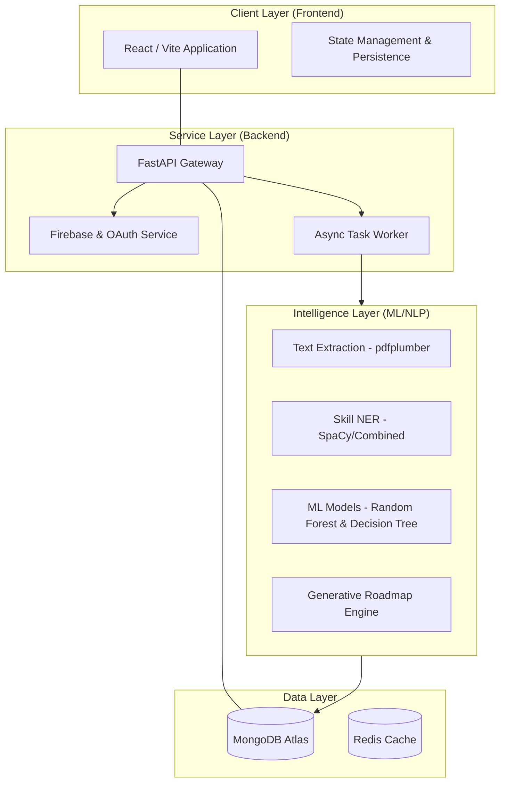
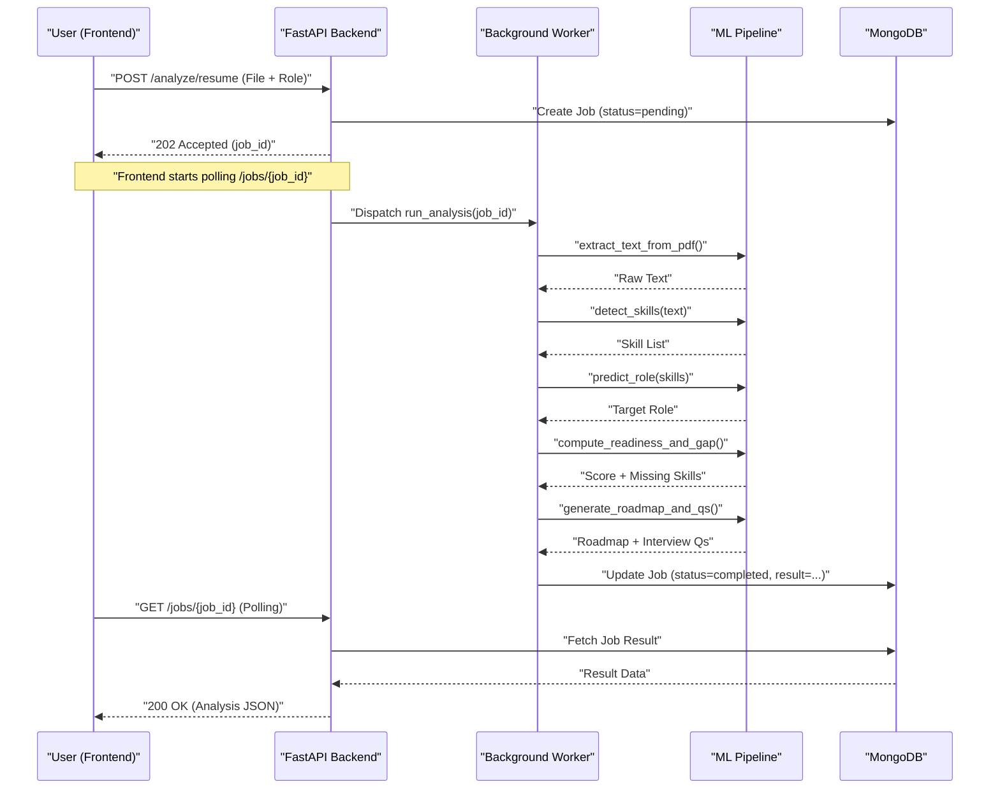
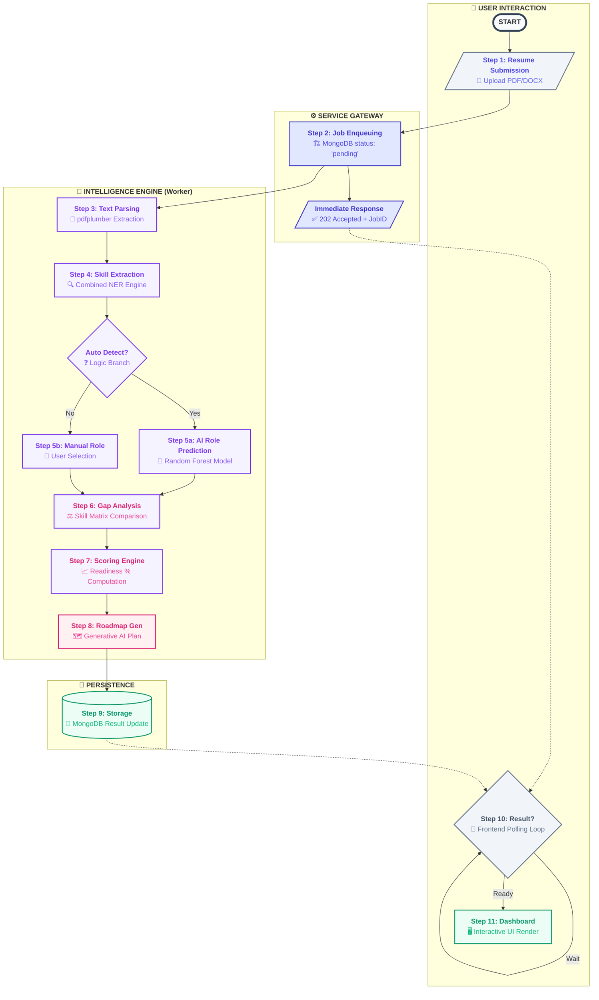

# AI Skill Gap Analyzer: Complete Platform Workflow

This document provides a detailed, illustrative workflow of the **AI Skill Gap Analyzer** platform, from user interaction to background AI processing.

---

## 1. High-Level System Architecture

The platform is built on a modern, asynchronous stack designed for high performance and scalability.

---

## 2. The Core Workflow: Resume Analysis & Roadmap Generation

The heart of the platform is the asynchronous analysis pipeline. Here is the step-by-step sequence:

### Phase 1: Submission & Ingestion
1.  **User Upload**: The user uploads their resume (PDF/DOCX) and selects a target job role (or chooses "Auto Detect").
2.  **API Validation**: The backend validates the file (MIME type, size < 10MB) and creates a **Job Document** in MongoDB with status `pending`.
3.  **Immediate Response**: The API returns a `job_id` to the frontend instantly (HTTP 202 Accepted).

### Phase 2: Background Processing (The "Brain")
Once enqueued, the `worker.py` takes over:

1.  **Text Extraction**: The PDF/DOCX is parsed into raw text using `pdfplumber`.
2.  **Skill Detection**:
    *   A combination of **Named Entity Recognition (NER)** and **Pattern Matching** identifies programming languages, tools, and frameworks.
    *   Skills are normalized and categorized.
3.  **Role Prediction (if "Auto Detect")**:
    *   The platform uses a **Random Forest model** to analyze the detected skills and predict the most likely job role (e.g., "Backend Developer").
4.  **Skill Gap Analysis**:
    *   The user's skills are compared against the target role's requirements.
    *   A **Decision Tree model** identifies critical missing skills.
5.  **Scoring & Roadmap**:
    *   A **Readiness Score** is calculated based on the match percentage.
    *   A **10-Week Learning Roadmap** is generated, prioritizing the most important missing skills.
    *   **Technical Interview Questions** are generated specifically for the detected skill gaps.

### Phase 3: Result Retrieval
1.  **Polling**: The frontend polls the status endpoint (`/api/v1/jobs/{job_id}`) every 2 seconds.
2.  **Completion**: Once the worker finishes, the job status moves to `completed`.
3.  **Visualization**: The frontend fetches the final analysis and renders:
    *   **Circular Progress** for the Readiness Score.
    *   **Skill Clouds** for detected vs. missing skills.
    *   **Interactive Timeline** for the roadmap.

---

## 3. Data Flow Sequence Diagram

---

## 4. 🚀 Detailed Execution Blueprint (Vertical Flow)

This blueprint illustrates the vertical progression of a single analysis request, highlighting the decision logic and background processing loops.

---

## 5. Secondary Workflows

### Authentication Flow (Hybrid)
*   **OAuth**: Users can sign in via Google or GitHub.
*   **OTP**: Email-based login uses Firebase to send One-Time Passwords for secure, passwordless entry.
*   **JWT**: The backend issues short-lived Access Tokens and long-lived Refresh Tokens.

### Market Trends & Monitoring
*   **Weekly Refresh**: Every Monday, a scheduler (`APScheduler`) triggers a market data refresh, scraping/updating trending skills for each role.
*   **Model Monitoring**: The system audits ML model performance weekly, checking for "concept drift" to ensure skill predictions remain accurate.
*   **Alerts**: If a user is "subscribed" to a role, they receive alerts when new trending skills are detected in the market.

---

## 6. Technology Stack Summary

| Layer | Technology |
| :--- | :--- |
| **Frontend** | React, Vite, Tailwind CSS, Recharts, Framer Motion |
| **Backend** | FastAPI (Python), Uvicorn, APScheduler |
| **Database** | MongoDB (NoSQL), Motor (Async Driver) |
| **AI/ML** | SpaCy, Scikit-Learn, PDFPlumber, Gemini AI |
| **Infrastructure**| Vercel (Frontend), Render/AWS (Backend), MongoDB Atlas |
| **Auth** | Firebase Admin SDK, GitHub/Google OAuth2 |
